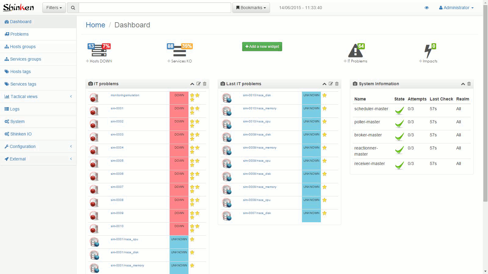

#mod-webui

###Description
Shinken Web User Interface

###Installation

####BS3 branch

If you want to test this branch (assuming you already have the WebUI installed):

```
$ git clone -b bs3 https://github.com/shinken-monitoring/mod-webui
$ sudo shinken install --local mod-webui
```

To update, just `git pull` the repository, and reinstall it with the same command.

####Master branch

* Install the webui module from shinken.io
```
$ shinken install webui
```
* Add it into the modules of the broker configuration :
```
$ cat /etc/shinken/brokers/broker-master.cfg
[...]
modules     webui
[...]
```
* Install an authentication module. For instance
```
$ shinken install auth-cfg-password
```

* Declare it on the WebUI configuration :
```
$ cat /etc/shinken/modules/webui.cfg
[...]
modules             auth-cfg-password
[...]
```

* Configure WebUI parameters :
```
$ vi /etc/shinken/modules/webui.cfg
```
 This file is commented and self explanatory ...


* Restart shinken and connect to the WebUI that will be available on the 7767 port.
```
root@system# /etc/init.d/shinken restart
```

###Screenshots



###Dependencies


###Report a bug
* A helpful title - use descriptive keywords in the title and body so others can find your bug (avoiding duplicates).
* WebUI Version and branch
* Steps to reproduce the problem, with actual vs. expected results
* OS version
* Browser and Version
* If the problem happens with specific code, link to test files (gist.github.com is a great place to upload code).
* Screenshots are very helpful if you're seeing an error message or a UI display problem. (Just drag an image into the issue description field to include it).

###Contributing
1. Fork it.
2. Create a branch (`git checkout -b my_branch`)
3. Commit your changes (`git commit -am "Major fixup."`)
4. Push to the develop branch (`git push develop my_branch`)
5. Open a [Pull Request](https://github.com/shinken-monitoring/mod-webui/pulls)
6. Enjoy a refreshing Diet Coke and wait :+1:
