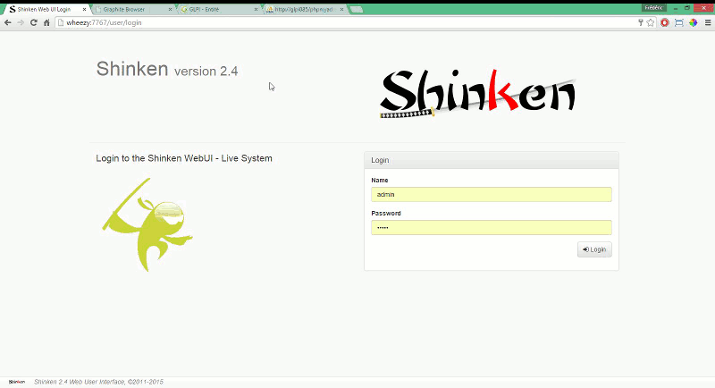

# Shinken Web User Interface

## Description
Shinken Web User Interface

Current version is 2.0.1, available on [`shinken.io`](http://shinken.io/package/webui2).

## Installation

 View installation procedure in the project Wiki: https://github.com/shinken-monitoring/mod-webui/wiki/Installation

## Screenshots

## Dependencies

Dependencies are listed in the [`requirements.txt`](https://github.com/shinken-monitoring/mod-webui/blob/develop/requirements.txt)  file.

## Report a bug

See the [`contributing.md`](https://github.com/shinken-monitoring/mod-webui/blob/develop/contributing.md) file.

## Contributing

See the [`contributing.md`](https://github.com/shinken-monitoring/mod-webui/blob/develop/contributing.md) file.
