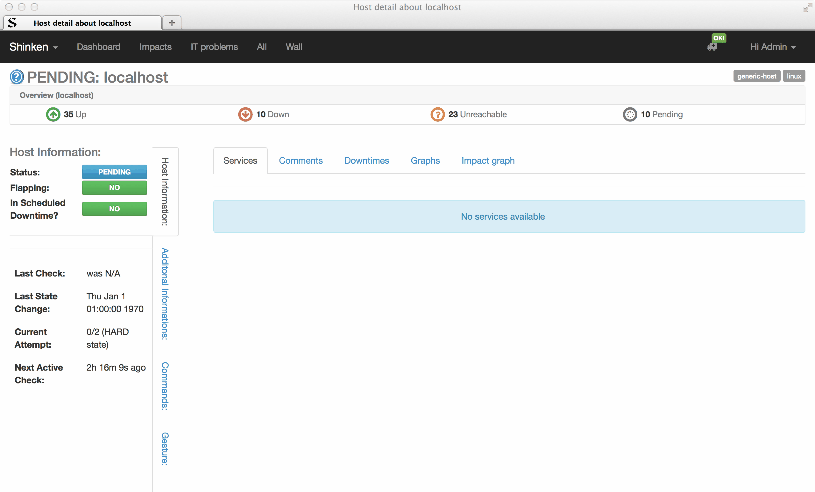

#mod-webui

###Description
Shinken main Web interface

###Most recent version
 Due to in-progres refactoring of this Shinken module, the most recent Web Interface is available in the BS3 branch of this repository. You are kindly invited to install, test and report your user experience on this new branch ... 

 Please do not hesitate to install this new version and make some reports with issues in this repository. Detailed installation instructions are available in the readme.md file of BS3 branch : https://github.com/shinken-monitoring/mod-webui/tree/bs3.
 
 We are currently using and testing this UI on a production environment (> 1K hosts and > 20K services) without any disagreement but we are aware that some improvements are still needed ! Thanks for your interest in this project ...

###Screenshots

Host Detail

System

###Dependencies

###Installation

*$ shinken install webui*

###Report a bug
* A helpful title - use descriptive keywords in the title and body so others can find your bug (avoiding duplicates).
* WebUI Version and branch
* Steps to reproduce the problem, with actual vs. expected results
* OS version
* Browser and Version
* If the problem happens with specific code, link to test files (gist.github.com is a great place to upload code).
* Screenshots are very helpful if you're seeing an error message or a UI display problem. (Just drag an image into the issue description field to include it).

###Contributing
1. Fork the repository.
2. Create a branch (`git checkout -b my_branch`)
3. Commit your changes (`git commit -am "Major fixup."`)
4. Push to the develop branch (`git push develop my_branch`)
5. Open a [Pull Request](https://github.com/shinken-monitoring/mod-webui/pulls)
6. Enjoy a refreshing Diet Coke and wait :+1:
