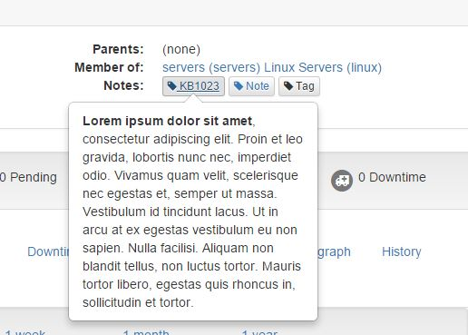

# Element properties for WebUI


## Nagios host/service definition
------------------------------------

The following host/service definition properties are **not** used in the WebUI : 

- icon_image
- icon_image_alt
- vrml_image
- statusmap_image
- 2d_coords
- 3d_coords


## Main properties
------------------------------------

Given this host definition:
```
define host{
   use                  generic-host, shinken2, linux-ssh, important
   host_name            wheezy
   address              127.0.0.1
   alias                Shinken on Debian Wheezy
   display_name         Fred's testing server

   business_impact      3

   hostgroups           servers

   contact_groups       admins

# Graphite prefix
   #_GRAPHITE_PRE        test

# GPS
   _LOC_LAT             45.054700
   _LOC_LNG             5.080856

   
   ...
}
```

WebUI displays all the host properties in the element view: 



More information in the [host view documentation page](./host_view.md) and [service view documentation page](./service_view.md).


## GPS coordinates
------------------------------------

GPS coordinates are used by the WebUI Worldmap plugin to display hosts location on a Google map. Latitude and logitude are provided in, respectively, _LOC_LAT and _LOC_LNG host custom variables.

Host definition:
```
define host{

   ... 
   
# GPS
   _LOC_LAT             45.054700
   _LOC_LNG             5.080856

   ...
}
```


## Custom views
------------------------------------

Custom views may be provided by the Shinken packs to enrich the WebUI element view. Each additional custom view creates a tab in the element view.

TODO: to be completed ...


Host definition:
```
define host{

   ... 

   # Defined in host template
   #custom_views                 +linux_ssh,linux_ssh_memory,linux_ssh_processes
   custom_views                 +linux_ssh

   ...
}
```


## Notes / notes urls
------------------------------------

Notes and notes urls properties are allowed in the host and service definitions. They are used to provide an optional string of notes pertaining to the host/service.

Shinken core does not allow to define the *notes* property more than once ... and the *note* is defined as a simple text.

WebUI allows to use a simple syntax to enrich the element notes : 

- a double colon (::) allows to define a **title** and a **description** inside the note : title::description
- a double comma (,,) allows to define an **icon** and a **title** inside the title : title;;icon

A list of notes may be declared in the *notes* property. Notes are separated with a | character.

A list of notes url may be declared in the *notes_url* property. Notes url are separated with a | character.

Host/service definition:
```
define host{
   ...
   # Element notes definition:
   
   # Define a simple classic note
   #notes                Lorem ipsum dolor sit amet, consectetur adipiscing elit. Proin et leo gravida, lobortis nunc nec, imperdiet odio. Vivamus quam velit, scelerisque nec egestas et, semper ut massa. Vestibulum id tincidunt lacus. Ut in arcu at ex egestas vestibulum eu non sapien. Nulla facilisi. Aliquam non blandit tellus, non luctus tortor. Mauris tortor libero, egestas quis rhoncus in, sollicitudin et tortor.
   
   # Define a classic note with a title
   #notes                KB1023::note with a title

   # Define a note with a title and an icon
   #notes                KB1023,,tag::<strong>Lorem ipsum dolor sit amet</strong>, consectetur adipiscing elit. Proin et leo gravida, lobortis nunc nec, imperdiet odio. Vivamus quam velit, scelerisque nec egestas et, semper ut massa. Vestibulum id tincidunt lacus. Ut in arcu at ex egestas vestibulum eu non sapien. Nulla facilisi. Aliquam non blandit tellus, non luctus tortor. Mauris tortor libero, egestas quis rhoncus in, sollicitudin et tortor.

   # Define two notes with a title and an icon
   #notes                KB1023,,tag::<strong>Lorem ipsum dolor sit amet</strong>, consectetur adipiscing elit. Proin et leo gravida, lobortis nunc nec, imperdiet odio. Vivamus quam velit, scelerisque nec egestas et, semper ut massa. Vestibulum id tincidunt lacus. Ut in arcu at ex egestas vestibulum eu non sapien. Nulla facilisi. Aliquam non blandit tellus, non luctus tortor. Mauris tortor libero, egestas quis rhoncus in, sollicitudin et tortor.|KB1024,,tag::<strong>Lorem ipsum dolor sit amet</strong>, consectetur adipiscing elit. Proin et leo gravida, lobortis nunc nec, imperdiet odio. Vivamus quam velit, scelerisque nec egestas et, semper ut massa. Vestibulum id tincidunt lacus. Ut in arcu at ex egestas vestibulum eu non sapien. Nulla facilisi. Aliquam non blandit tellus, non luctus tortor. Mauris tortor libero, egestas quis rhoncus in, sollicitudin et tortor.

   notes_url            http://www.my-KB.fr?host=$HOSTADDRESS$|http://www.my-KB.fr?host=$HOSTNAME$
   
   ...
}
```

The element notes are located in the overview panel of the element view. Each note is displayed as a button including the **title** and the **icon**. The note **description** is displayed in a popover when hovering the title. If an Url is defined, the **title** is a navigable link.


## Actions urls
------------------------------------

Actions urls property is allowed in the host and service definitions. It is used to to define an optional URL that can be used to provide more actions to be performed on the host/service.

Shinken core does not allow to define the *action_url* property more than once ... 

WebUI allows to use a simple syntax to enrich the element notes : 

- a double colon (::) allows to define a **title** and a **url** inside the action url : title::url
- a double comma (,,) allows to define an **icon** and a **title** inside the title : title;;icon
- a double comma (,,) allows to define a **description** for the url : description::url

Host/service definition:
```
define host{
   ...
   # Element actions definition:
   
   # List of actions (same syntax as for notes)
   action_url           http://www.google.fr|url1::http://www.google.fr|My KB,,tag::http://www.my-KB.fr?host=$HOSTNAME$|Last URL,,tag::<strong>description</strong>With a more important description of the link ...,,http://www.my-KB.fr?host=$HOSTADDRESS$

   ...
}
```

The action urls are located in a dropdown list of the element view. Each url is displayed as a list element including the **title** and the **icon**. The **description** is displayed in a popover when hovering the list element. If an Url is defined, the **list element** is a navigable link.


