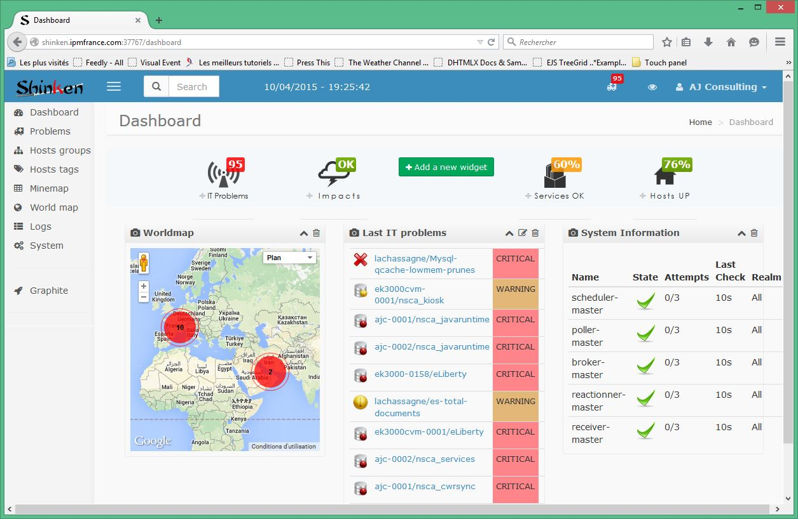
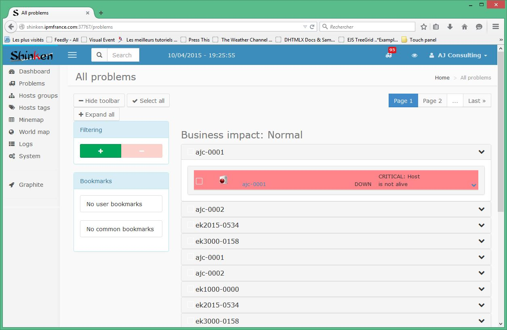
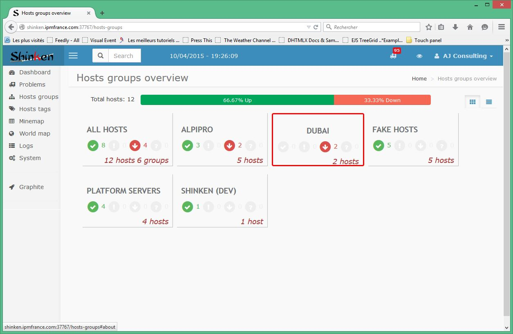
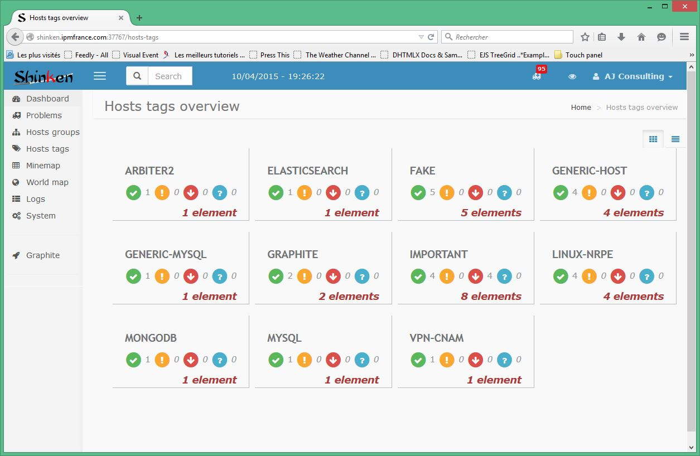
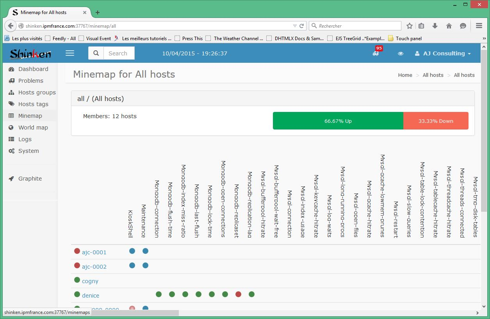
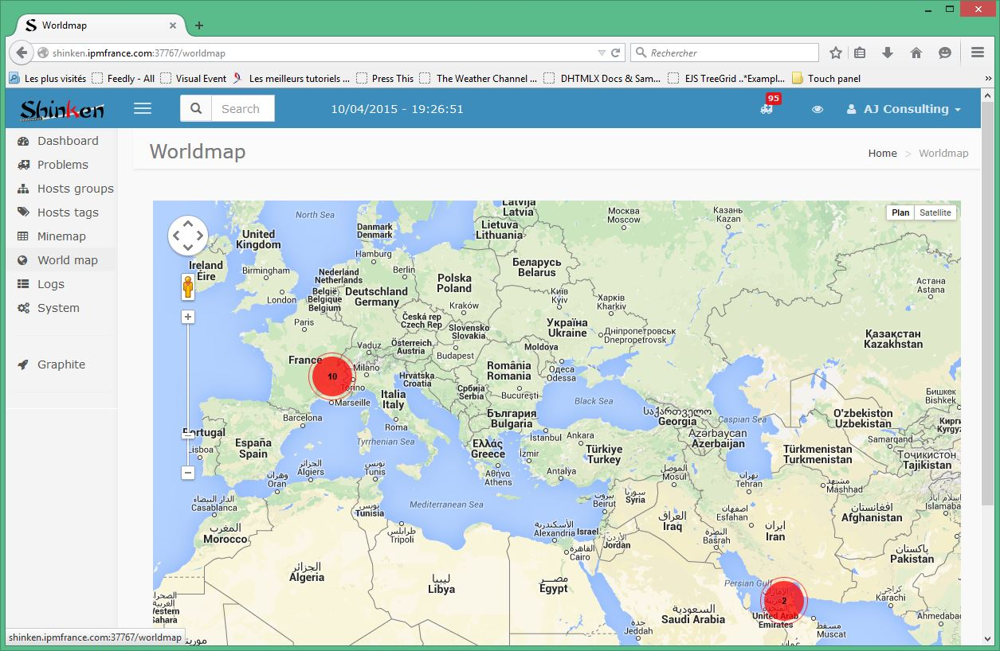
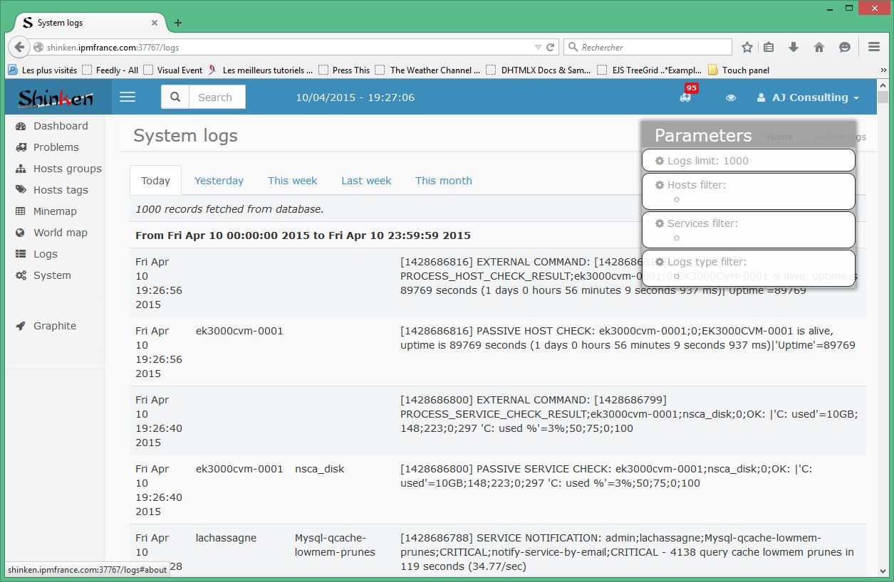
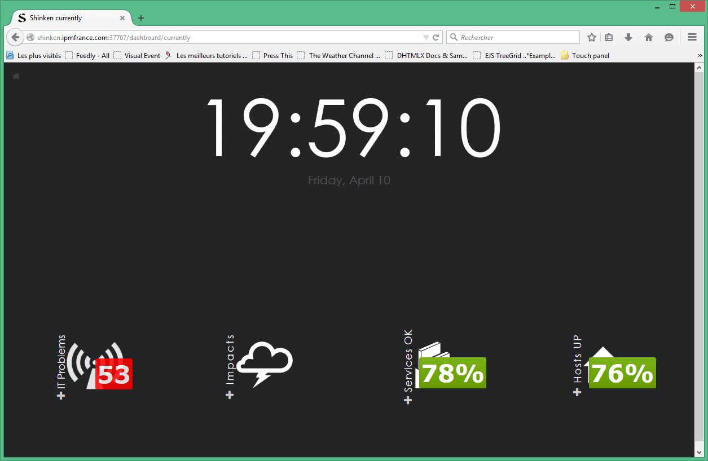
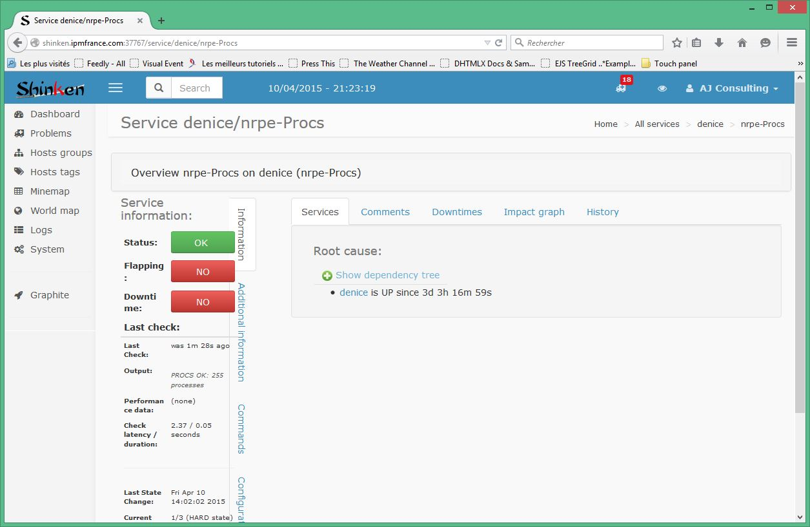

====================================
User's guide
====================================

Shinken Web User Interface is built with a modern Javascript library (Bootstrap 3) to allow access with most Web browser.

Logging in
------------------------------------

On the application login page, log in with the provided username and password.

Once logged in the user is relocated on the home page. 

On the top of the page a navigation bar that allows to :

- hide / show the side bar menu
- search for an host
- display the "one eye monitoring view"
- show logged in user information / settings

On the left side of the page a side bar menu to switch between application pages : 
- Dashboard
- Problems
- Hosts groups
- Hosts tags
- Minemap
- World map
- Logs
- System
- Graphite

The following chapters introduce every feature.

Dashboard
------------------------------------
On top of the Dashboard page, a summary bar with main information about the system status : 
- current problems 
- main impacts on business
- monitored hosts status summarized as a percentage
- monitored services status summarized as a percentage

On the page, some widgets that main be chosen by the logged in user:

To add a widget on the dashboard page, click on "Add a new widget" and then choose the desired widget.

Problems
------------------------------------
The problems page displays the current detected problems on the system. Problems are presented in a list of collapsible elements sorted by level of criticity.

On the left side of the page, it is possible to filter the problems list and to set bookmarks that may be global or user specifically stored.

Hosts groups
------------------------------------
The hosts groups page is a view of the monitored hosts grouped by hosts groups. This view is switchable from box to list thanks to the upper right icons.

Each hosts group contains information about the Up, Unreachable, Down and Unknown hosts status.

Hovering a group allows to switch to the details or minemap view for the group.

Groups are logical hosts grouping.

Hosts tags
------------------------------------
The hosts tags page is a view of the monitored hosts grouped by hosts tags. This view is switchable from box to list thanks to the upper right icons.

Each hosts group contains information about the Up, Unreachable, Down and Unknown hosts status.

Hovering a group allows to switch to the details view for the group.

Tags are monitoring profiles hosts grouping.

Minemap
------------------------------------
The minemap page is a view of the monitored hosts and services in a matrix (you know the famous minemap game ...).

Worldmap
------------------------------------
The worldmap page is a view of the monitored hosts on a Google map.

Each host is located on the world map with a marker colored depending upon host overall state. Depending upon the zoom level, hosts are grouped in a cluster which colors depend upon all included hosts overall state.

Host overall state is computed as is:

- if host state is not Up, orange/red color for unreachable/down

- if host state is Up, 

   - if at least one service is Critical, red color
   - if at least one service is Warning, orange color
   -  if all services are Ok, green color

Note that it is possible to view an OSM map layout instead of Google's one ...

Logs
------------------------------------
The logs page displays the monitoring system logs for all the system.

System
------------------------------------
The system page displays the status of all the Shinken daemons.

"one eye monitoring view"
------------------------------------
In the navigation bar, the eye icon enables to switch to this view that is a fullscreen display of the main information concerning the overall system status.

An icon of top left of this view allows to go back to Dashboard page.

Host view
------------------------------------
When an host is selected, the host element view displays all information known about this host.

On the host view, the user can, on the left tabs menu : 

- view information (Information tab) about the host and the last checks on this host

- view extra information (Additional information tab) 

- send commands (Commands tab) to the host, it his login enables this feature

- view configuration variables (Configuration tab), also known as Custom host variables

On the right side, the user can : 

- view graphical status of the host (note that all hosts do not have such a view)

- view host services status (Services tab) 

- view comments and acknowledges (Comments tab) for the host. Comments are texts sent when an host status is acknowledged with the Acknowledge command.

- view graphs (Graphs tab) for the host. Graphs are performance data sent with the host check (heartbeat)

- view impact graph (Impact graph tab) for the host. 

- view logs (Logs graph tab) for the host. Overall system logs are filtered for the current host (last 100 logs)

Service view
------------------------------------
When a service is selected, the service element view displays all information known about this service.

On the service view, the user can, on the left tabs menu : 

- view information (Information tab) about the service and the last checks on this service

- view extra information (Additional information tab) 

- send commands (Commands tab) to the service, it his login enables this feature

- view configuration variables (Configuration tab), also known as Custom service variables

On the right side, the user can : 

- view service dependencies status (Services tab) 

- view comments and acknowledges (Comments tab) for the service. Comments are texts sent when a service status is acknowledged with the Acknowledge command.

- view graphs (Graphs tab) for the service. Graphs are performance data sent with the service check (metrics)

- view impact graph (Impact graph tab) for the host. 

- view logs (Logs graph tab) for the host. Overall system logs are filtered for the current service (last 100 logs)

